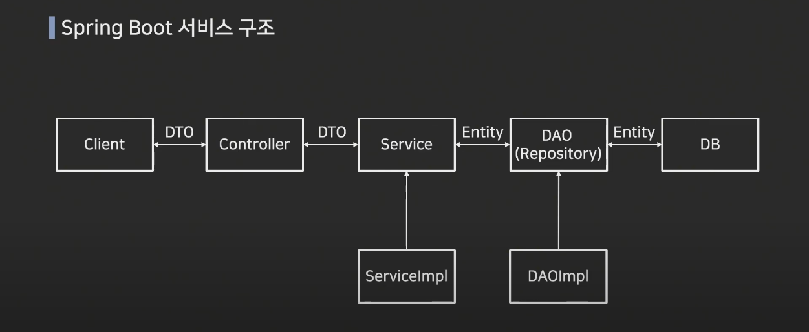

# Spring Boot 서비스 구조

#### Client

- client에서 controller에 request를 넣을때 일반적으로 DTO 객체를 사용하여 데이터를 전달한다

#### DTO(Data Transfer Object) 

- DTO는 VO(V Object)로 불리기도하며 계층간 데이터 교환을 위한 객체를 의미

- VO의 경우 read only의 개념을 가지고 있음

#### 1. Controller

- 요청 판단 후 서비스 객체로 DTO랑 같이 보냄

ex)
AdminController 의 createCampingBasic은 CampingBasicDTO객체에 해당하는 필드에 맞는 JSON형태의 body를 입력받은다음 CampingBasicDTO객체로 변환하여 파라미터에 전달받는다.

변수에 CampingBasicDTO객체의 값들을 저장하고 해당 값들을 campingBasicService의 saveCampingBasic 메소드에 전달한다.

#### 2. Service

- 비지니스 로직 전반적인 내용을 처리한다.
-  DTO 객체에 담아있는 것에 추가적으로 담거나 뺄 내용을 수정하여 Entity 객체를 생성한다.

ex)
전달받은 값들을 campingBasicHandler에 그대로 전달하여 변경할 값들을 처리한다.

그 값들로 campingBasicEntity객체를 생성하고, 생성한 Entity객체를 campingBasicDao의 saveCampingBasic 메소드에 전달한다.

#### Entity

- 데이터베이스 테이블에 1:1로 맵핑되는 객체이다

#### 3. DAO(Data Access Object)

- 데이터베이스에 접근하는 객체를 의미(Persistance Layer)
- DB와 직접 통신하는 영역
- Service 가 DB에 연결할 수 있게 해주는 역할
- DB를 사용하여 데이터를 조회하거나 조작하는 기능을 전담

ex)
전달받은 campingBasicEntity객체를 사용하여 campingBasicRepository의 메소드에 전달한다.

#### 4. Repository

- Entity 에 의해 생성된 DB에 접근하는 **메소드를 사용하기 위한** 인터페이스
- service와 DB를 연결하는 고리의 역할을 수행
- DB에 적용하고자 하는 CRUD를 정의하는 영역

ex)
전달받은 campingBasicEntity객체를 사용하여 DB와 연결하고, 해당하는 CRUD 메소드를 이욯아여 DB에 저장한다.

