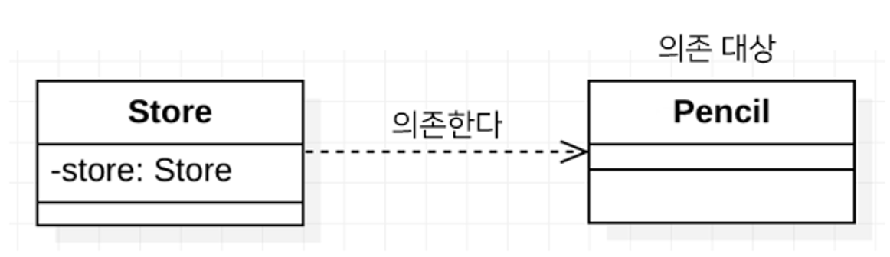
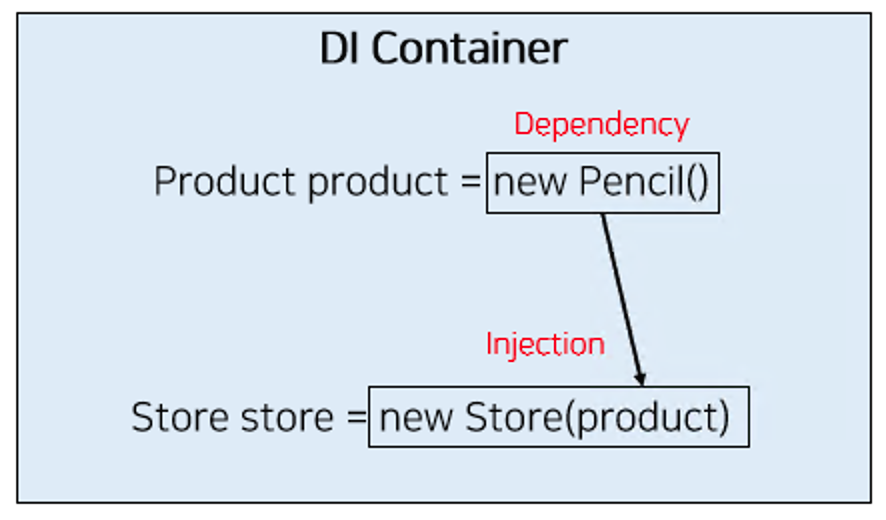

# Spring에서 의존성 주입이란?

## 1. 의존성 주입(Dependency Injection)의 개념과 필요성

#### 의존성 주입(Dependency Injection) 이란?

Spring 프레임워크는 3가지 핵심 프로그래밍 모델을 지원하고 있는데, 그 중 하나가 **의존성 주입(Dependency Injection, DI)** 이다. DI란 외부에서 두 객체 간의 관계를 결정해주는 디자인 패턴으로, 인터페이스를 사이에 둬서 클래스 레벨에서는 의존관계가 고정되지 않도록 하고 런타임 시에 관계를 다이나믹하게 주입하여 유연성을 확보하고 결합도를 낮출 수 있게 해준다.

의존성이란 한 객체가 다른 객체를 사용할 때 의존성이 있다고 한다.

예를 들어 다음과 같이 Store 객체가 Pencil 객체를 사용하고 있는 경우에 우리는 Store객체가 Pencil 객체에 의존성이 있다고 표현한다.

```
public class Store {

    private Pencil pencil;

}
```





그리고 두 객체 간의 관계(의존성)를 맺어주는 것을 의존성 주입이라고 하며 **생성자 주입, 필드 주입, 수정자 주입** 등 다양한 주입 방법이 있다.




 

#### 의존성 주입(Dependency Injection)이 필요한 이유

예를 들어 연필이라는 상품과 1개의 연필을 판매하는 Store 클래스가 있다고 하자.

```
public class Pencil {

}
public class Store {

    private Pencil pencil;

    public Store() {
        this.pencil = new Pencil();
    }

}
```

위와 같은 예시 클래스는 크게 다음과 같은 문제점을 가지고 있다.

- 두 클래스가 강하게 결합되어 있음
- 객체들 간의 관계가 아니라 클래스 간의 관계가 맺어지고 있음

**1. 두 클래스가 강하게 결합되어 있음**

위와 같은 Store 클래스는 현재 Pencil 클래스와 강하게 결합되어 있다는 문제점을 가지고 있다. 두 클래스가 강하게 결합되어 있어서 만약 Store에서 Pencil이 아닌 Food와 같은 다른 상품을 판매하고자 한다면 Store 클래스의 생성자에 변경이 필요하다. 즉, 유연성이 떨어진다. 각각의 다른 상품들을 판매하기 위해 생성자만 다르고 나머지는 중복되는 Store 클래스들이 파생되는 것은 좋지 못하다. 이에 대한 해결책으로 상속을 떠올릴 수 있지만, 상속은 제약이 많고 확장성이 떨어지므로 피하는 것이 좋다.

 

**2. 객체들 간의 관계가 아니라 클래스 간의 관계가 맺어지고 있음**

또한 위의 Store와 Pencil는 객체들 간의 관계가 아니라 클래스들 간의 관계가 맺어져 있다는 문제가 있다. 올바른 객체지향적 설계라면 객체들 간에 관계가 맺어져야 하지만 현재는 Store 클래스와 Pencil 클래스가 관계를 맺고 있다. 객체들 간에 관계가 맺어졌다면 다른 객체의 구체 클래스(Pencil인지 Food 인지 등)를 전혀 알지 못하더라도, (해당 클래스가 인터페이스를 구현했다면) 인터페이스의 타입(Product)으로 사용할 수 있다.

 

결국 위와 같은 문제점이 발생하는 근본적인 이유는 Store에서 불필요하게 어떤 제품을 판매할 지에 대한 관심이 분리되지 않았기 때문이다. Spring에서는 DI를 적용하여 이러한 문제를 해결하고자 하였다.

 

#### 의존성 주입(Dependency Injection)을 통한 문제 해결

위와 같은 문제를 해결하기 위해서는 우선 다형성이 필요하다. Pencil, Food 등 여러 가지 제품을 하나로 표현하기 위해서는 Product 라는 Interface가 필요하다. 그리고 Pencil에서 Product 인터페이스를 우선 구현해주도록 하자.

```
public interface Product {

}
public class Pencil implements Product {

}
```

 

이제 우리는 Store와 Pencil이 강하게 결합되어 있는 부분을 제거해주어야 한다. 이를 제거하기 위해서는 다음과 같이 외부에서 상품을 주입(Injection)받아야 한다.

```
public class Store {

    private Product product;

    public Store(Product product) {
        this.product = product;
    }

}
```

 

여기서 Spring이 DI 컨테이너를 필요로 하는 이유를 알 수 있는데, 우선 Store에서 Product 객체를 주입하기 위해서는 애플리케이션 실행 시점에 필요한 객체(빈)를 생성해야 하며, 의존성이 있는 두 객체를 연결하기 위해 한 객체를 다른 객체로 주입시켜야 하기 때문이다.

예를 들어 다음과 같이 Pencil 이라는 객체를 만들고, 그 객체를 Store로 주입시켜주는 역할을 위해 DI 컨테이너가 필요하게 된 것이다.

```
public class BeanFactory {

    public void store() {
        // Bean의 생성
        Product pencil = new Pencil();
    
        // 의존성 주입
        Store store = new Store(pencil);
    }
    
}
```

 

 그리고 이러한 개념은 제어의 역전(Inversion of Control, IoC)라고 불리기도 한다. 어떠한 객체를 사용할지에 대한 책임이 BeanFactory와 같은 클래스에게 넘어갔고, 자신은 수동적으로 주입받는 객체를 사용하기 때문이다. (실제 Spring에서는 BeanFactory를 확장한 Application Context를 사용한다.)

 

 

## 2. 의존성 주입(Dependency Injection, DI) 정리

#### 의존성 주입(Dependency Injection) 정리

한 객체가 어떤 객체(구체 클래스)에 의존할 것인지는 별도의 관심사이다. Spring에서는 DI 컨테이너를 통해 서로 강하게 결합되어 있는 두 클래스를 분리하고, 두 객체 간의 관계를 결정해 줌으로써 결합도를 낮추고 유연성을 확보하고자 하였다. 의존성 주입으로 애플리케이션 실행 시점에 객체를 생성하고 관계를 결정해 줌으로써 다른 구체 클래스에 의존하는 코드를 제거하며 서로 다른 두 객체의 결합을 약하게 만들어 주었다. 또한 이러한 방법은 상속보다 훨씬 유연하다. 단, 여기서 주의해야 하는 것은 다른 빈을 주입받으려면 자기 자신이 반드시 컨테이너의 빈이여야 한다는 것이다.

 

- 두 객체 간의 관계라는 관심사의 분리
- 두 객체 간의 결합도를 낮춤
- 객체의 유연성을 높임
- 테스트 작성을 용이하게 함

 

하지만 의존 관계를 주입할 객체를 계속해서 생성하고 소멸한다면, 아무리 GC가 성능이 좋아졌다고 하더라도 부담이 된다. 그래서 Spring에서는 Bean들을 기본적으로[ 싱글톤(Singleton)](https://mangkyu.tistory.com/151)으로 관리하는데, 우리는 이에 대해 자세히 알 필요가 있다.